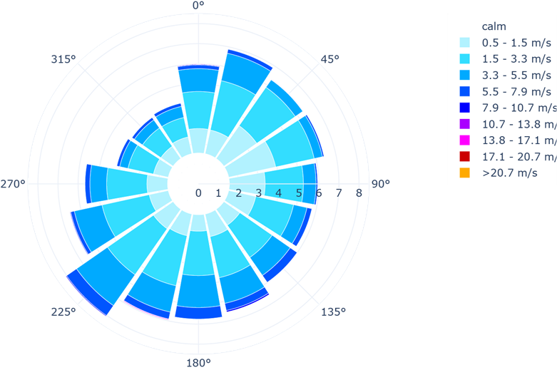

# Advanced Meteorological Data Analysis 🌦️

## 📋 Overview

This repository contains the project for the exam **Modelli e tecniche per i Big Data** of the Master’s degree in Computer Engineering at the University of Calabria, focusing on advanced meteorological data analysis using **Dash** for front-end and **PySpark** for back-end.  
The project was carried out in September 2023.  
The front-end was adapted from an open-source project developed by [CenterForTheBuiltEnvironment](https://github.com/CenterForTheBuiltEnvironment/clima). We thank the original authors for their contribution:  
- **Giovanni Betti** (Lead Developer, [gbetti](https://github.com/gbetti))  
- **Christine Nguyen** (Developer, [chrlng](https://github.com/chrlng))  

---

## 🎯 Project Objective

- This is a **educational project** aimed at applying and reinforcing key concepts in data analysis and distributed computing, particularly focusing on **Apache Spark**.
- The project involves building a system that enables users to perform aggregate queries on a large dataset of meteorological data sourced from numerous weather stations across the U.S.
- The application uses **PySpark** to execute computationally intensive operations, ensuring scalability and efficiency.
- A user-friendly front-end, built using **Dash**, provides an interactive and intuitive interface for visualizing results and conducting data analysis.

---

## 🗂️ Repository Structure

- **`assets/`**: Includes supporting files such as images, icons, and static data files.  
- **`docs/`**: Contains the technical report and presentation of the project.  
- **`jobs/`**: Contains PySpark job scripts like `spark_jobs.py`.  
- **`preprocessing/`**: Scripts and notebooks for data preprocessing (`preprocessing.ipynb`).  
- **`test/`**: Notebooks for testing clustering (`test_clustering.ipynb`).    
- **`requirements.txt`**: File with necessary dependencies.  
- **`main.py`**: Entry point to execute the project.  

---

## 🚀 Running the Project

### 1. Clone the repository
```bash
git clone https://github.com/fulvio9999/spark-meteorological-project.git
cd spark-meteorological-project
```

### 2. Download the complete dataset and copy in `assets/data/dataset_completo/`:
```bash
cd assets/data/dataset_completo
#Note: The dataset is large, and interested users must contact me directly to obtain it.
```

### 3. Create a new Conda environment
```bash
conda create --name meteodata_env python=3.9
conda activate meteodata_env
```

### 4. Install dependencies
```bash
pip install -r requirements.txt
```

### 5. Start the application
```bash
python main.py
```

The application will be accessible at: [http://localhost:8282](http://localhost:8282)

---
## 🖼️ Screenshots & Spark Workflow

### Screenshots of the Application
Here are some screenshots demonstrating the application’s interface:

#### 1. **Dashboard Overview**
<p align="center">
    
</p>

#### 2. **Clustering Results**
<p align="center">
    
</p>

#### 3. **Some of the interactive visualizations**

<p align="center">
    
    
    
    
  
</p>

---

### Spark Workflow Summary
To better understand how **Apache Spark** processes data in this project, the following diagram illustrates key steps and functionalities:
<p align="center">
    
    
    
</p>

---

## 🧑‍🤝‍🧑 Collaboration

This project was developed in collaboration with [FrancescoArcuri13](https://github.com/FrancescoArcuri13). Thank you for the support and teamwork! 🙌

---


## 🛠️ Technologies Used

- **PySpark**: for data processing and clustering.
- **Dash**: for front-end development.
- **Plotly**: for graphical visualizations.
- **Pandas** and **NumPy**: for preliminary data analysis.
- **Conda**: for managing the virtual environment.

---

## 🙏 Acknowledgements

A special thanks to the creators of the original front-end project, [CenterForTheBuiltEnvironment](https://cbe-berkeley.gitbook.io/clima/), for inspiring and enabling the development of this application.
